# SHIELD

**Saml dokumentationen. Afklar det ukendte. Udarbejd konsekvensanalyse og risikovurdering.**

SHIELD er et dansk arbejdsrum til vurdering af **AI-løsninger og IT-løsninger med AI-funktioner** i en kommunal sammenhæng. Det samler leverandørmateriale, kommunens påtænkte anvendelse, kildebelæg, afklaringsopgaver og rapportversioner på én sag.

Målet er et dokumenteret grundlag for dialog mellem sagsbehandler, systemejer, IT, informationssikkerhed, jura, DPO og den ansvarlige godkender. Vurderingen kan læses i løsningen og hentes som Word og Excel.

En konsekvensanalyse vedrørende databeskyttelse kaldes også en **DPIA**. I SHIELD forbindes beskrivelsen af behandlingen med de risici, den kan medføre for de registrerede, og de foranstaltninger, kommunen skal tage stilling til.

**Aktuel produktversion: v0.10.1.** Versionsnummeret vises i løsningen og vedligeholdes i [`frontend/src/config/brand.js`](frontend/src/config/brand.js). Ældre pakkenavne og versionsnumre findes fortsat i projektets tekniske historik.

Versionsnummeret hæves ved hver afsluttet samling af ændringer i løsningen. Brug `npm run version:bump -- patch` til rettelser og mindre forbedringer eller `-- minor` til nye funktioner. Kommandoen opdaterer det synlige nummer, pakkefilerne, lockfilen og denne README samlet. Tilføj ændringerne i [CHANGELOG.md](CHANGELOG.md), og byg brugerfladen igen. `npm run version:check` kontrollerer sammenhængen og køres også før frontendstart og build. Genbygning af samme kode hæver ikke i sig selv nummeret.

> SHIELD er beslutningsstøtte. En genereret tekst, en lav risikoscore eller en JEV-kontrol udgør ikke en juridisk godkendelse. Skærmbillederne nedenfor viser en faglig arbejdsversion med en påtænkt kommunal anvendelse. De dokumenterer ikke et faktisk kommunalt indkøb, implementerede foranstaltninger eller en godkendelse fra Kalundborg Kommune.

## Til næste AI-agent

Start i [AGENTS.md](AGENTS.md) for arbejdsregler og [HANDOFF.md](HANDOFF.md) for den aktuelle branch, drift, skills, teststatus og begrænsninger. Den gamle Judge Dredd/Tyr-checkout er ikke grundlaget for denne SHIELD-version.

## Indhold

- [Hvad løsningen kan](#hvad-løsningen-kan)
- [Arbejdsgangen i billeder](#arbejdsgangen-i-billeder)
- [GPT, JEV og menneskelig gennemgang](#gpt-jev-og-menneskelig-gennemgang)
- [Rapporter, kilder og historik](#rapporter-kilder-og-historik)
- [Lokal opstart](#lokal-opstart)
- [Opsætning af AI](#opsætning-af-ai)
- [Kontrol og test](#kontrol-og-test)
- [Arkitektur og API](#arkitektur-og-api)
- [Adgang, drift og nuværende begrænsninger](#adgang-drift-og-nuværende-begrænsninger)
- [Videre dokumentation](#videre-dokumentation)

## Hvad løsningen kan

| Behov | Funktion i SHIELD |
| --- | --- |
| Undersøge en ny AI-løsning | Opret en sag med løsning, leverandør, fagområde, ansvarlig og kommunens konkrete anvendelse. |
| Samle leverandørens dokumentation | Upload PowerPoint, Word, PDF og tekst, eller tilføj en offentlig hjemmeside. Materialet knyttes til sagen. |
| Forstå materialet | AI foreslår kildeunderstøttede oplysninger, fremhæver modstridende udsagn og formulerer spørgsmål til det, der mangler. |
| Fastholde kommunens ansvar | Medarbejderen vælger selv, hvilke oplysninger der må indgå i vurderingsgrundlaget, og dokumenterer sin gennemgang. |
| Udarbejde en konsekvensanalyse | Et struktureret spørgeskema danner en regelbaseret grundvurdering med afsnit og risikopunkter fra den versionslåste skabelon. AI kan derefter udarbejde teksten. |
| Se, hvad der skal ske nu | Rapporten skelner mellem dokumenteret grundlag, afklaringsbehov, mangler, risici og anbefalinger. |
| Arbejde med risici | Hvert risikopunkt beskriver hændelse, årsag, konsekvenser og forslag til foranstaltninger samt den beregnede risiko. |
| Følge op | Opret afklaringsopgaver med ansvarlig, frist, svar og status. Opgaverne følger sagen. |
| Samarbejde med jura | Hent et Word-dialoggrundlag fra materialegennemgangen eller den samlede konsekvensanalyse i Word og Excel. |
| Se hvad AI og JEV gjorde | Fanen Teknisk kørsel forbinder gemte versioner, modeller, input, output, kildeuddrag og JEV-kontrolpunkter. |
| Bevare beslutningsgrundlaget | Gemte analyser og rapportrevisioner bevares. Kilder, modeloplysninger og relevante kontrolresultater følger versionen. |
| Hjælpe nye brugere i gang | En interaktiv introduktion tilbydes ved første login og kan startes igen fra menuen eller indstillinger. |
| Finde arbejdet igen | Kategoriseret livesøgning finder sager, vurderinger, dokumenttitler, begreber og vejledninger – også ved mindre stavefejl. Samme søgning åbnes med ⌘K / Ctrl+K. |
| Genbruge systemnavne | Søg efter løsning og leverandør fra et lokalt importeret systemkatalog, eller skriv et navn manuelt. Relationernes dokumenterede roller vises særskilt. |

Løsningen vurderer den **konkrete anvendelse**. En AI-assistent til interne projektmøder har ikke nødvendigvis samme behandlingsgrundlag, risici eller krav som samme produkt brugt i borgersamtaler. Et produktnavn eller en generel SaaS-beskrivelse dokumenterer heller ikke i sig selv en AI-funktion.

## Arbejdsgangen i billeder

### Login og det fælles arbejdsrum

Login viser den identitet, backend faktisk har bekræftet. På den lokale installation fortsætter man som **Parthee** i en tydeligt markeret fælles lokal session. Ved Entra-opsætning bruges Microsoft-login og servervaliderede roller. Den lokale fortsætknap er ikke et personligt kommunalt login.

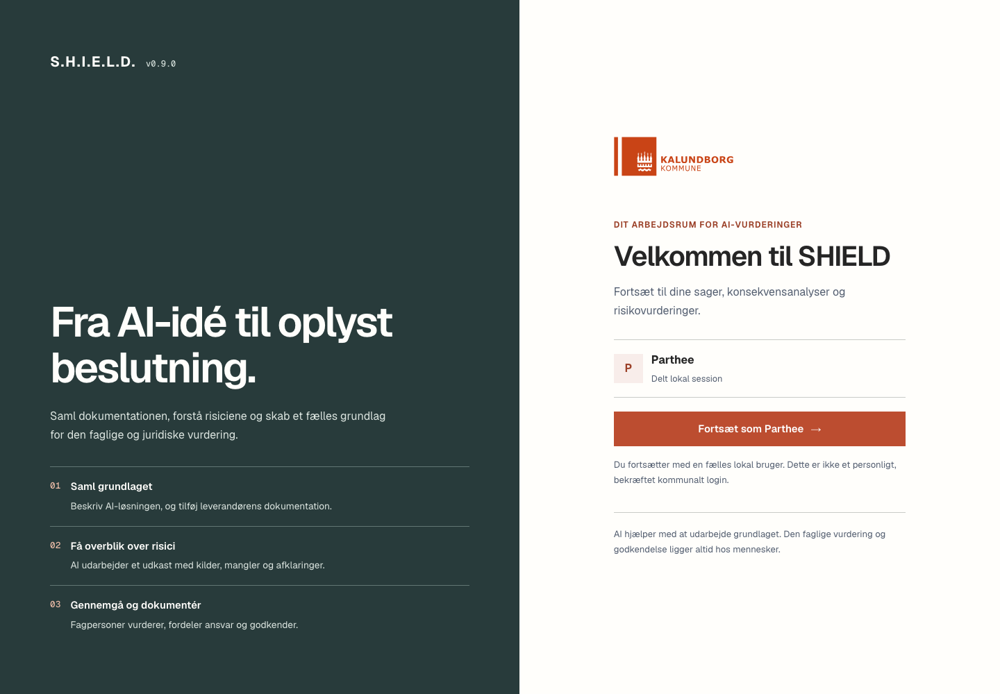

Forsiden prioriterer søgning, næste handling og aktuelle sager. Søgning og hurtig navigation bruger samme resultater; der vedligeholdes ikke to forskellige søgekataloger. Kilderesultater åbner det relevante dokument eller den præcise vejledning. Sagsindhold kræver en sagsrolle, og private søgeresultater ryddes ved afslutning af sessionen.

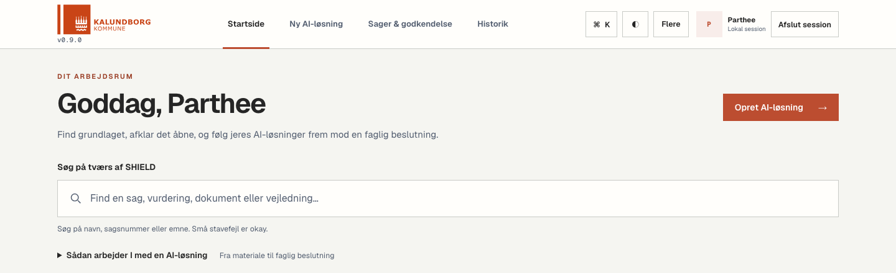

**Viden og vejledning** samler begreber og rapporter i to faner. **Juridisk arbejdsrum** skelner mellem at finde kilder og spørge til lovgivning. AI Act-arbejdsrummet skelner mellem en gemt vurdering på en sag og den supplerende EU-vejviser. Den særskilte manuelle sagsoprettelse ligger under **Andre muligheder**, med forklaring af hvornår den er relevant.

### 1. Start med den løsning, kommunen vil bruge

Forsiden giver en indgang til at oprette en AI-løsning, finde eksisterende sager og forstå arbejdsgangen. Brugeren behøver ikke begynde med hele konsekvensanalysen; første skridt er at beskrive behovet og samle et brugbart grundlag. På første trin kan kommunens behovsnotat, kravbeskrivelse eller præsentation vedlægges som PDF, DOCX, PPTX eller tekst. Dokumenterne gemmes ved oprettelse og mærkes særskilt som kommunens behovsbeskrivelse.

Alle trin kan åbnes, før felterne er udfyldt, både ved oprettelse af en AI-løsning og i konsekvensanalysens spørgeramme. Man kan orientere sig og vende tilbage uden at miste indtastninger under navigationen. Spørgsmålstegnet ved et felt viser en kort forklaring ved mus, tastaturfokus eller tryk. Materiale knyttes først til en gemt sag, og spørgerammens manglende oplysninger kontrolleres, når brugeren vælger **Udarbejd vurdering**.

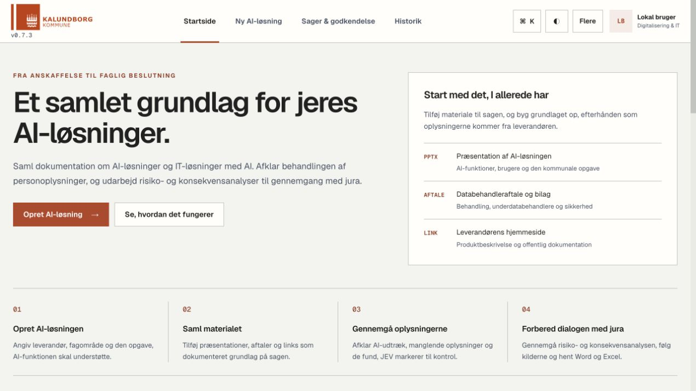

**Det vigtige i dette trin:** Beskriv AI-funktionen, brugerne, opgaven og de oplysninger, den skal behandle. Kommunens formål er styrende; leverandørens generelle produktbeskrivelse er en kilde, der skal undersøges.

### 2. Følg sagerne fra kladde til opfølgning

Sagsoversigten samler løsningerne og deres placering i processen. Den gør det muligt at se, hvor arbejdet er nået til, og åbne den enkelte sag med dens dokumentation, vurderinger og opgaver. Godkendelse og idriftsættelse er særskilte handlinger med adgangskrav.

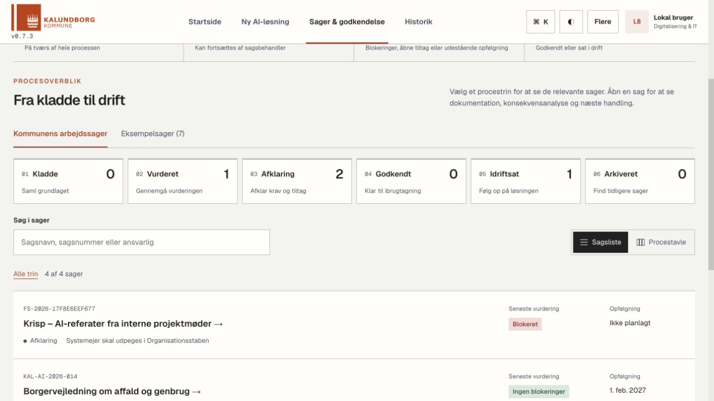

**Det vigtige i dette trin:** En sag kan være vurderet og stadig have åbne forhold. At en rapport er færdigskrevet betyder ikke, at løsningen er godkendt til brug.

### 3. Saml præsentationer, aftaler og anden dokumentation

På materialetrinnet kan brugeren tilføje eksempelvis en leverandørpræsentation, databehandleraftale, sikkerhedsbeskrivelse, revisionsrapport og links til officielle produktsider. Dokumentgrundlaget viser, hvilke materialetyper der er vedlagt. Eventuelle problemer med tekstudtræk vises ved den enkelte kilde. Kildenavigatoren gør det muligt at søge i de gemte tekstuddrag og finde deres placering og version.

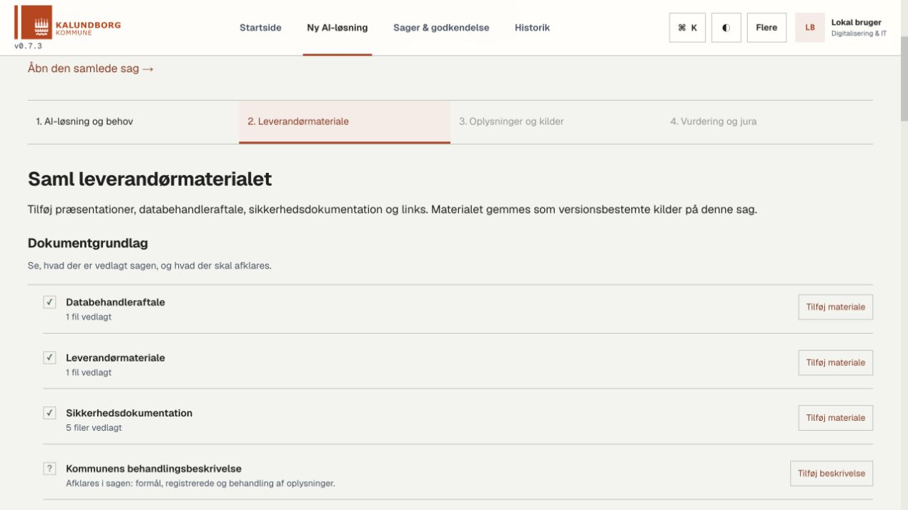

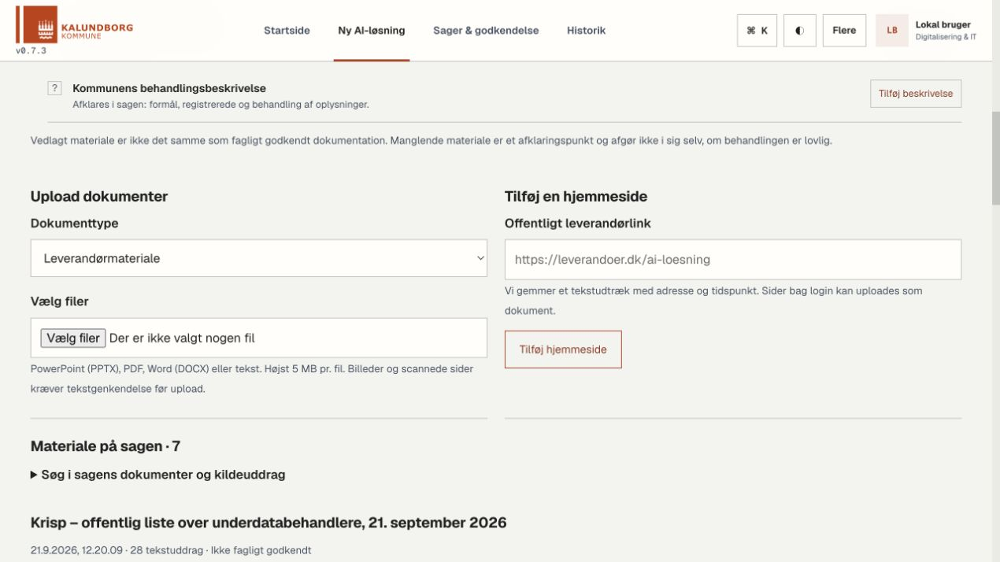

**Billedet viser:** Filer kategoriseres efter dokumenttype. Et hjemmesidelink gemmes som tekstudtræk med kildeadresse og tidspunkt, og materialet kan genfindes på sagen.

**Det vigtige i dette trin:** En vedlagt databehandleraftale er ikke nødvendigvis underskrevet, og et udsagn om certificering er ikke det samme som en gennemgået revisionsrapport. SHIELD skal bevare denne forskel i analysen.

Efter analyse gennemgår medarbejderen de foreslåede oplysninger og deres kildebelæg. Accepterede oplysninger kan overføres til konsekvensanalysen. Uafklarede spørgsmål skal stadig besvares; de bliver ikke automatisk til et nej.

### 4. Læs konklusion, afklaringer og mangler først

Den gemte vurdering viser tydeligt løsningens navn og giver et struktureret resumé. Læseren kan få overblik over status og opfølgning, før de enkelte afsnit foldes ud. Konsekvensanalysen, risikovurderingen, anbefalingerne og kilderne har adskilte visninger.

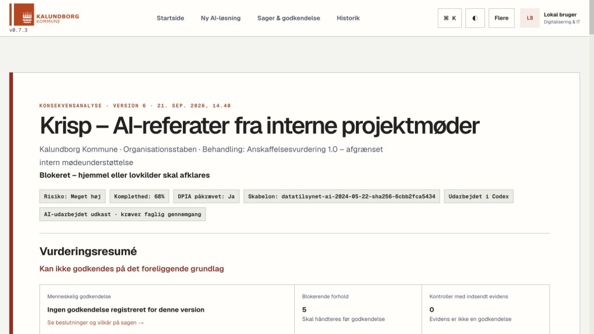

**Det vigtige i dette trin:** Det skal være synligt, hvad grundlaget understøtter, hvad der kræver faglig afklaring, og hvad der mangler før en godkendelse kan overvejes. En AI-formulering kan ikke fjerne en registreret blokering.

### 5. Undersøg risikoen og mulige foranstaltninger

Risikovurderingen præsenterer punkterne i en oversigt med filtre, sideinddeling og foldbare detaljer. Højeste restrisiko vises først. Detaljerne gør det muligt at undersøge, hvad der kan ske, hvorfor det kan ske, hvem det kan ramme, og hvilke foranstaltninger der kan mindske risikoen.

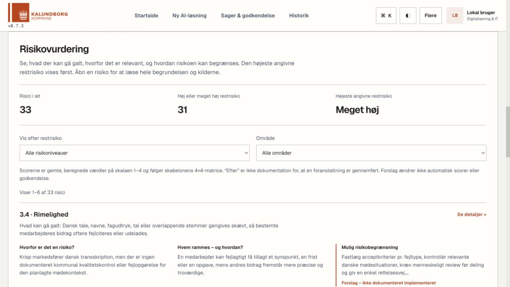

**Det vigtige i dette trin:** En foreslået foranstaltning er endnu ikke implementeret. Eksempelvis kræver sletning, adgangsstyring og menneskelig kontrol en konkret beslutning, opsætning og dokumentation. En lavere risiko kan ikke begrundes alene med, at AI har foreslået en kontrol.

### 6. Hold anbefalinger adskilt fra vurderingen

Anbefalinger har deres egen visning. De kan pege på en anden teknisk løsning, snævrere anvendelse, lokal behandling eller en mere konkret slettepraksis, når det er relevant for sagen. Forslagene skal undersøges og besluttes særskilt.

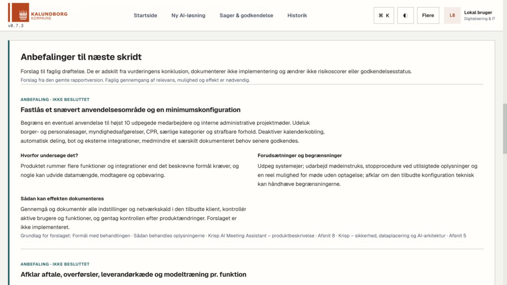

**Det vigtige i dette trin:** En anbefaling dokumenterer hverken leverandørens funktionalitet eller kommunens beslutning. Den ændrer ikke i sig selv risikoscoren eller sagens godkendelsesstatus.

## GPT, JEV og menneskelig gennemgang

SHIELD har en tydelig arbejdsdeling mellem tekstudarbejdelse, kildekontrol, faste regler og mennesker:

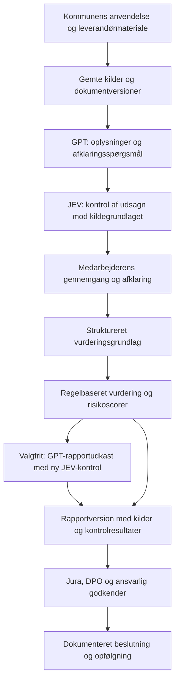

### GPT skriver og strukturerer

Den almindelige AI-funktion bruger **`openai/gpt-5.5` via Vercel AI Gateway**. Modellen er fastlagt i arbejdsgangens serverkode og bruges til at foreslå oplysninger fra materialet samt udarbejde danske rapporttekster, afklaringsspørgsmål og anbefalinger.

Modellen skal referere til det medsendte materiale. Materialeanalyse kontrollerer blandt andet, at angivne citater faktisk findes i de relevante tekstuddrag. Leverandørmateriale behandles som data og må ikke overtage analysens instruktioner.

Der findes desuden **manuel modelimport**, hvor et faktisk udkast fra eksempelvis GPT-5.6 Sol eller GPT-6 Astra kan importeres med kørselsoplysninger og efterfølgende JEV-kontrol. Importen er en særskilt operatørstyret vej; den registrerede model skal have udført arbejdet. Den enkelte rapport viser modelnavnet, mens det tekniske revisionsspor bevares. Se [AI-dokumentationen](docs/AI_GATEWAY.md).

### JEV markerer udsagn, som kræver gennemgang

**`typesafe-ai/jev`** er evaluator i AI-arbejdsgangen. JEV får tekst, relevante kilder og kontrolkriterier og hjælper med at finde blandt andet manglende kildebelæg, modstridende oplysninger og planlagte foranstaltninger, der fejlagtigt fremstilles som gennemført.

Kontrollen omfatter også sammenhængen mellem et risikopunkts faste definition og den genererede risikotekst. JEVs markeringer følger den gemte rapport og hjælper læseren med at prioritere gennemgangen.

JEV kan både overse fejl og markere korrekte tekster. Den aktuelle grænse på **0,5** er en teknisk prioriteringsgrænse, som ikke er kalibreret som kommunal juridisk godkendelsesstandard. Et resultat uden markeringer er derfor ikke bevis for sandhed, lovlighed eller tilstrækkelig dokumentation.

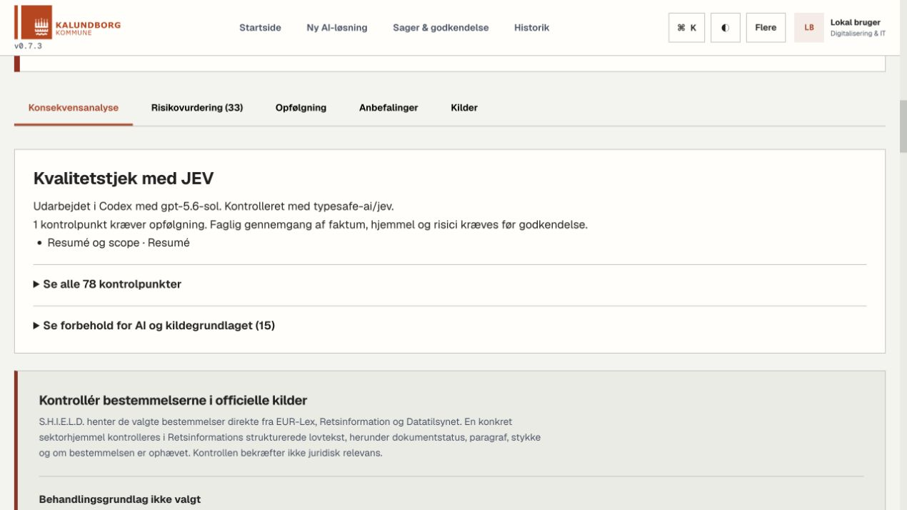

**Billedet viser:** Den gennemførte kontrol gør det synligt, hvilken model der udarbejdede teksten, hvilken evaluator der blev brugt, og hvad mennesker stadig skal følge op på. Lovkildekontrollen vises særskilt.

### Regelmotoren fastholder vurderingens rammer

Den grundlæggende vurdering kan oprettes **uden en LLM-provider**. Faste regler behandler formularens oplysninger og fastlægger blandt andet DPIA-behov, risikoscorer, manglende oplysninger og blokeringer.

AI må ikke ændre disse låste værdier eller erklære et blokerende forhold løst. Modeltræning, behandlingens omfang, tredjelandsoverførsler, DPO-inddragelse og faktisk menneskelig kontrol kan stå som **Ikke afklaret**. Svaret bevares i formularen, kildegrundlaget og Word/Excel; det bliver ikke omskrevet til et nej. Hvor ukendt omfang, overførsel eller menneskelig kontrol påvirker screening og risikoscore, fremgår den forsigtige beregningsforudsætning udtrykkeligt. Et kontraktkrav om menneskelig kontrol dokumenterer ikke, at kontrollen er etableret. Nye risikoforslag holdes adskilt fra skabelonens beregnede risici og kræver særskilt faglig stillingtagen.

### Mennesker vælger, afklarer og godkender

Human in the loop er en del af sagens arbejde:

1. **Sagsbehandler og systemejer** beskriver anvendelsen, indsamler materiale og gennemgår de foreslåede oplysninger.
2. **IT og informationssikkerhed** afklarer blandt andet dataflow, adgang, sletning, drift og tekniske foranstaltninger.
3. **Jura og DPO** kan bruge kilder, åbne spørgsmål og rapportudkast til den relevante retlige og databeskyttelsesfaglige gennemgang.
4. **Den ansvarlige godkender** træffer og dokumenterer beslutningen inden for de tildelte roller.
5. **Sagens ansvarlige** følger op på vilkår, opgaver og senere ændringer i anvendelse eller leverandørgrundlag.

Et accepteret AI-forslag er en oplysning i arbejdsgrundlaget. Det er ikke en særskilt retlig godkendelse, og et dokumenteret afklaringssvar ændrer ikke automatisk alle tidligere analyser.

## Rapporter, kilder og historik

### Konsekvensanalyse og risikovurdering

Den centrale rapportmodel følger projektets versionslåste AI-konsekvensanalyseskabelon med **39 afsnit og 33 risikopunkter**. Excel-eksporten udfylder skabelonen med den gemte vurdering og bevarer dens struktur og risikomatrice. Rapporten er et arbejdsgrundlag til gennemgang; brug af skabelonen er ikke en godkendelse fra Datatilsynet.

| Leverance | Indhold |
| --- | --- |
| Rapport i løsningen | Resumé, afgrænsning, konsekvensanalyse, risikovurdering, anbefalinger, opfølgning og kilder. |
| Word | En samlet læsbar rapport med den valgte versions tekst, risici, anbefalinger og relevante kontroloplysninger. |
| Excel | De otte oprindelige skabelonark; AI-rapporter får desuden et ark med kilder og kvalitetsoplysninger. |
| Juridisk dialoggrundlag | Et Word-notat fra materialegennemgangen med anvendelse, udvalgte oplysninger, kildebelæg, JEV-markeringer og åbne spørgsmål. |

Word og Excel dannes fra den **valgte gemte vurdering**. Alle risikopunkter følger med, selv om brugerfladen kun viser en del ad gangen.

### Sporbarhed

- Originalmateriale og hjemmesideudtræk gemmes med dokumentversion og checksum.
- Tekstuddrag har kilde-ID og, hvor udtrækket understøtter det, placering i dokumentet.
- Kilder, model- og promptoplysninger samt JEV-resultater følger AI-versionen.
- Ændret materiale eller ændret anvendelse kræver en ny analyse, før oplysningerne kan overføres videre som opdateret grundlag.
- Manuel rapportredigering gemmer en ny version med ændringsnotat og før/efter-historik.
- Ændrede tekster arver ikke stiltiende en gammel JEV-kontrol; berørte kontroller markeres som forældede.
- Sagens overgange, opgaver og beslutninger holdes sammen med dens øvrige dokumentation.

En checksum viser, hvilken filversion der er brugt. Den viser ikke i sig selv, at dokumentets indhold er korrekt, dækkende eller juridisk gældende.

Se [versioner, ansvar og menneskelig opfølgning](docs/CASE_WORKSPACE_VERSIONS_AND_OWNERS.md) for eksportgruppering, ændringshistorik, JEV-opfølgning og databasemigration.

### Teknisk kørsel på den enkelte sag

Åbn **Teknisk kørsel** ved siden af sagens øvrige faner. Vælg en gemt kørsel for at undersøge modellen, behandlingsforløbet, de gemte input og tekster samt JEVs kontrolpunkter og deres kildegrundlag. En genvej fra rapporten åbner den relevante vurderingsversion.

Historiske oplysninger vises, hvor de faktisk er gemt. Manglende oplysninger markeres, og manuelle revisioner skelnes fra nye AI-kørsler. JEVs problemsignal er et hjælpemiddel til gennemgang; en individuel fritekstbegrundelse vises ikke, når den ikke er gemt. Se [vejledningen til Teknisk kørsel](docs/TECHNICAL_RUNS.md).

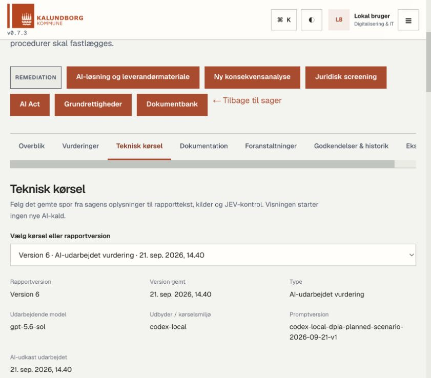

*Krisp-sagens version 6 viser den registrerede udarbejdende model og promptversion. Versionsvælgeren giver adgang til tidligere AI- og regelbaserede vurderinger.*

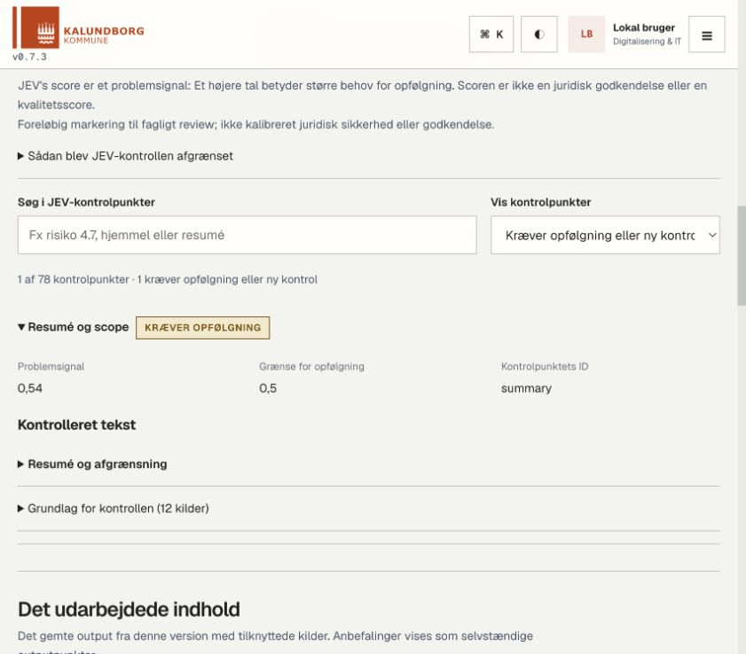

*JEV-visningen prioriterer kontrolpunkter, der kræver opfølgning. Her er resuméet markeret med problemsignalet 0,54 ved en grænse på 0,5. Den kontrollerede tekst og de 12 henviste kilder kan foldes ud. Det er ikke en juridisk godkendelse.*

### Introduktion for nye brugere

Ved første login tilbydes en guide gennem sager, dokumenter, vurdering, gennemgang og download. Guiden kan springes over, genoptages og startes igen fra **profilmenuen under dit navn → Start introduktionsguide** eller **Indstillinger**. Fremdriften gemmes pr. autentificeret bruger og guideversion. Guiden opretter ikke sager og foretager ikke modelkald.

## Lokal opstart

Den direkte lokale opsætning nedenfor understøtter både den regelbaserede vurdering og AI-arbejdsgangen, når Gateway er konfigureret.

### Forudsætninger

- Python **3.11** som i projektets backend-image.
- Node.js **22.18 eller nyere**, fordi serverens AI-scripts kører TypeScript direkte.
- npm **9 eller nyere** og Git.
- Adgang til Vercel AI Gateway og de anvendte modeller, hvis AI-funktionerne skal køres.

### 1. Hent kode og installer afhængigheder

```bash
git clone https://github.com/Parthee-Vijaya/SHIELD.git
cd SHIELD
python3 -m venv .venv
source .venv/bin/activate
python -m pip install -r requirements.txt
npm ci
test -f .env || cp .env.example .env
```

På Windows aktiveres miljøet med `.venv\Scripts\activate`. Kommandoerne nedenfor bruger macOS/Linux-syntaks.

### 2. Konfigurér et lokalt miljø

Redigér `.env` lokalt. Disse værdier giver en lokal SQLite-installation med udviklingsidentitet:

```dotenv
DATABASE_URL=sqlite:///./data/virkning.db
APP_ENV=development
AUTH_MODE=development
DEV_AUTH_USER=Parthee
DEV_AUTH_ROLES=Hammeren.Sagsbehandler,Hammeren.Godkender,Hammeren.DPO,Hammeren.Admin
API_HOST=127.0.0.1
API_PORT=8001
API_RELOAD=false
CASE_REMINDER_ENABLED=false
NOTIFICATION_DIGEST_ENABLED=false
RETENTION_ENABLED=false
```

Udviklingsidentiteten er til lokal brug. Den er ikke et organisationslogin. Påmindelser og automatisk sletning er deaktiveret i denne opskrift; driftspolitikker skal vælges eksplicit ved en senere installation. SMTP er ikke nødvendigt for vurdering og eksport og bør kun konfigureres, hvis mailfunktionerne skal bruges.

### 3. Start backend

Kør fra repository-roden i et terminalvindue med Python-miljøet aktiveret:

```bash
python main.py
```

Backend opretter manglende lokale tabeller ved opstart. Kontroller klargøringen på [http://127.0.0.1:8001/readyz](http://127.0.0.1:8001/readyz). Endpointet kontrollerer database, vurderingslagring og eksportskabelon. Det bekræfter **ikke** adgang til AI-modellerne.

### 4. Byg og start brugerfladen

I et andet terminalvindue fra repository-roden:

```bash
npm run build:frontend
FRONTEND_HOST=127.0.0.1 FRONTEND_PORT=8090 API_BACKEND=http://127.0.0.1:8001 node frontend/serve_prod.js
```

Åbn [http://localhost:8090](http://localhost:8090). Frontend-serveren videresender `/api`, `/readyz`, `/health` og `/metrics` til backend. Efter ændringer i brugerfladen skal den statiske build bygges igen.

Til frontendudvikling kan `npm run dev:frontend` bruges i stedet. Scriptet starter udviklingsserveren på port 8090 og bruger projektets proxy til backend på port 8001. Kør kun én frontend-server på porten ad gangen. Stop lokale terminalservere med `Ctrl+C`.

Til vedvarende lokal fremvisning på macOS beskriver [driftsvejledningen til launchd og Tailscale](docs/MACOS_TAILSCALE.md) automatisk genstart, privat fjernadgang og kontrol af forbindelsen.

### Data efter en ny kloning

Repositoryet indeholder **ikke den lokale sagsdatabase, uploadede dokumenter, lokale rapporter eller API-nøgler**. En ny installation indeholder derfor ikke automatisk sagerne fra skærmbillederne.

Opret egne sager via brugerfladen. Til afgrænset udvikling findes også en idempotent indlæsning af syntetiske kommunale præsentationsdata:

```bash
python -m src.cli.seed_municipal_portfolio
```

Denne indlæsning er ikke en import af den viste Krisp-vurdering og afvises i produktion. Se de tilhørende filer under [`examples/`](examples/) og [`src/cli/`](src/cli/).

### Docker

Projektet indeholder [`docker-compose.yml`](docker-compose.yml), backend-image og frontend-image med nginx. Den eksisterende opsætning bruger et navngivet datavolume og lokale porte 80 og 8001.

Docker-konfigurationen er **ikke en komplet pakning af den aktuelle AI Gateway-arbejdsgang**: backend-imaget inkluderer endnu ikke Node-runtime og AI-scripts, og frontend-imaget bruger en ældre Node-base. Brug den direkte lokale opsætning ovenfor til den samlede arbejdsgang. Dockerfilerne skal opdateres og verificeres, før de anvendes til samme formål.

## System- og leverandørkatalog

System- og leverandørfelterne søger i et lokalt importeret katalog fra Excel. Importen gemmer systemnavn, UUID, tilgængelighed og organisationernes dokumenterede roller samt filhash og importtidspunkt. Rettighedshaver og databehandler er forslag; de er ikke automatisk kommunens aftalepart. Kontaktpersoner og øvrig fritekst importeres ikke. Valg fra kataloget dokumenterer heller ikke, at løsningen indeholder AI.

Tag backup af databasen, aktivér backendens Python-miljø, og kontrollér importen fra projektroden. Importen bruger backendens `DATABASE_URL` fra miljøet eller `.env`:

```bash
python scripts/import_system_catalog.py "/sti/IT Systemkatalog Overblik.xlsx" --dry-run
```

Fjern `--dry-run` for at importere. Gentagen import af samme fil ændrer intet. Eksisterende sager og tidligere katalogudgaver bevares; søgningen bruger seneste import. Ingen forbindelse til KITOS er nødvendig. Det er et lokalt øjebliksbillede, som opdateres ved en ny import.

Katalogsøgning kræver en sagsrolle. Kilderegnearket og den lokale database skal holdes uden for Git. Uden katalog eller ved forbindelsesfejl kan brugeren stadig indtaste navnene manuelt.

## Opsætning af AI

### Nøglen forbliver på serveren

Opret `.env.local` i repository-roden, og indtast `AI_GATEWAY_API_KEY` **i en lokal editor**. Filen er ignoreret af Git. Nøglen må ikke kopieres til chat, screenshots, frontendkode, logfiler eller commits. Backendens Node-proces indlæser filen ved modelkald.

Hvis en installation bruger central secret management, kan variablen gives som servermiljøvariabel i stedet. Nøglen må aldrig bruge et `REACT_APP_`-præfiks eller bygges ind i klienten.

### Kontroller forbindelsen

```bash
npm run ai:example
npm run ai:jev-example
```

Det første eksempel bruger `generateText` fra `ai`, modellen `openai/gpt-5.5` og en ufølsom prompt om at opfinde en ny højtid. Det andet kontrollerer et syntetisk kildeeksempel med JEV. Kald kan koste Gateway-kreditter. Adgang til JEV beviser ikke adgang til GPT-modellen, og begge skal være tilgængelige for hele arbejdsgangen.

AI-knappen kræver korrekt serveropsætning og adgang til de fastlagte modeller. Fejl i generering eller evaluering afbryder oprettelsen af en ny AI-version; eksisterende resultater bevares. Der bruges ingen skjult erstatningsmodel.

Koden fastlåser `ai` til version **7.0.107**. Evaluatorgrænsefladen er eksperimentel, så opgraderinger kræver kontrol af kontrakter og test. Se [`docs/AI_GATEWAY.md`](docs/AI_GATEWAY.md).

### Midlertidig lokal tekstforbindelse

Ved lokal afprøvning kan `SHIELD_ENABLE_CODEX_LOCAL=true` gives til backendprocessen. Det kræver en installeret og allerede indlogget Codex CLI og bruger **GPT-5.6 Sol** til juridiske tekstsvar, sammenfatning af søgeresultater og udtræk til indledende screening. Funktionen er slået fra som standard og er ikke en SaaS-integration. Den læser eller kopierer ikke loginoplysninger. Hvert kald kører isoleret med værktøjer slået fra, højst to samtidige kald og en tidsgrænse på 150 sekunder. Den fælles forbindelsestest skal have modtaget et reelt svar, før den melder succes.

Denne tekstforbindelse erstatter ikke JEV eller AI Gateway-forløbet for materialeanalyse og rapportgenerering. Modelnavnet følger svarene; manglende kildebelæg og mislykkede kald vises som sådanne. Konfigurationen følger [OpenAI's officielle indstillingsreference](https://learn.chatgpt.com/docs/config-file/config-reference).

## Kontrol og test

Se [gennemgangen af v0.9.0](docs/QA_V090.md) for fund, rettelser, browserkontrol, testresultater og de kontroller, der stadig kræver en rigtig driftsopsætning.

Ved klargøringen til dette repository den **21. september 2026** bestod **584 backendtests, 201 frontendtests og 27 Gateway-tests** samt AI-typekontrollen. Det er en kontrol af den aktuelle kode og dens testscenarier, ikke en attestering af juridisk korrekthed eller produktionsdrift.

Kør fra repository-roden med Python-miljøet aktiveret:

```bash
python -m pytest tests/
CI=true npm run test:frontend -- --watchAll=false --runInBand
npm run ai:typecheck
npm run ai:test
npm run build:frontend
```

Testene dækker blandt andet vurderingsregler, rapportstruktur, kildehenvisninger, eksport, adgangskontrol, versionering, ændringskonflikter og interaktiv introduktion. Gateway-kontrakttest erstatter ikke en faktisk modelkørsel.

Ved en fuld gennemgang bør den konkrete arbejdsgang også prøves i browseren:

1. Opret en afgrænset sag og beskriv den påtænkte AI-anvendelse.
2. Vedlæg ufølsomt materiale og kontrollér læsbarhed og kildeplaceringer.
3. Kør materialeanalyse, gennemgå forslagene og gem et notat.
4. Opret vurderingen og kontroller mangler, blokeringer og risici.
5. Kør AI-udarbejdelsen, hvis Gateway er tilgængelig, og læs JEV-markeringerne.
6. Gem en opfølgningsopgave og prøv en rapportrevision.
7. Hent Word og Excel fra samme rapportversion og kontroller indhold og layout.

En klar `/readyz`, en bestået test eller en flot rapport er hver for sig utilstrækkeligt til at dokumentere, at hele AI-arbejdsgangen er kørt korrekt. Beskriv altid, hvilke trin der faktisk er afprøvet.

## Arkitektur og API

| Lag | Implementering |
| --- | --- |
| Brugerflade | React 18, React Router og styled-components. |
| API og validering | FastAPI og Pydantic. |
| Data | SQLAlchemy; lokal SQLite via `.env.example`, konfiguration til PostgreSQL findes. |
| Vurdering | Regelbaseret DPIA-vurdering og versionsstyrede rapportmodeller. |
| AI | Node.js, AI SDK og Vercel AI Gateway; GPT til udarbejdelse og JEV til kildekontrol. |
| Dokumentarbejde | Tekstudtræk fra understøttede filer og hjemmesider; Word-eksport og udfyldning af den låste Excel-skabelon. |
| Identitet | Lokal udviklingsidentitet eller Microsoft Entra ID med API-validering og roller. |

```text
SHIELD/
├── frontend/src/         Brugerflade, sagsarbejde og rapportvisninger
├── src/api/              API-ruter til de enkelte arbejdsgange
├── src/services/         Vurdering, materiale, AI, revision og eksport
├── src/database/         Lagringsmodeller og databaseadgang
├── src/auth/             Identitet og adgangskontrol
├── ai-gateway/           Modelkald, JEV-kontrol og kontrakttest
├── templates/dpia/       Versionslåst konsekvensanalyseskabelon
├── rules/                Juridiske regler og referencegrundlag
├── examples/             Afgrænsede udviklingseksempler
├── scripts/              Lokale udviklings- og kontrolværktøjer
├── tests/                Backend- og regressionstest
└── docs/                 Faglig og teknisk dokumentation
```

Udvalgte endpoints:

| Endpoint | Formål |
| --- | --- |
| `GET /readyz` | Klargøring af den regelbaserede vurdering og eksport. |
| `GET /api/auth/me` | API-valideret brugeridentitet og roller. |
| `POST /api/dpia/assessments` | Opret en regelbaseret vurdering. |
| `GET /api/dpia/assessments` | Find gemte vurderinger. |
| `GET /api/dpia/assessments/{id}` | Hent en bestemt vurderingsversion. |
| `POST /api/dpia/assessments/{id}/generate` | Udarbejd en ny AI-version. |
| `GET /api/dpia/assessments/{id}/export.docx` | Hent Word for den valgte version. |
| `GET /api/dpia/assessments/{id}/export.xlsx` | Hent Excel for den valgte version. |

Den komplette API-beskrivelse findes lokalt på [http://127.0.0.1:8001/docs](http://127.0.0.1:8001/docs). Sags- og dokumentfunktioner kræver de relevante roller.

## Adgang, drift og nuværende begrænsninger

SHIELD udvikles mod en SaaS-arbejdsgang, men den aktuelle kode er konfigureret omkring **én organisation**. Den er ikke en færdig tjeneste med isolation mellem kommunale kunder, abonnementer og driftsgarantier.

- **Entra ID og roller:** Microsoft-login og servervaliderede roller er implementeret. `APP_ENV=production` accepterer ikke udviklingsidentitet. De tekniske rollenavne har fortsat præfikset `Hammeren.` for kompatibilitet. Se [opsætningsvejledningen](docs/ENTRA_ID_SETUP.md).
- **Databeskyttelse ved AI:** Den relevante tekst og kilder sendes til Gateway/modeller ved AI-kald. Kommunen skal afklare aftaler, databehandling og rammerne for de oplysninger, der må sendes. En lokal brugerflade betyder ikke lokal modelbehandling.
- **Materiale:** Materialetrinnet understøtter PPTX, DOCX, PDF og TXT op til 5 MB pr. fil. Der er ikke indbygget OCR, talegenkendelse eller JavaScript-rendering af tilføjede hjemmesider. Scannede eller adgangsbeskyttede dokumenter kan derfor kræve anden klargøring.
- **Hjemmesider:** Kun offentligt tilgængeligt indhold kan indlæses. Private netværksadresser og usikre omdirigeringer afvises. Et link til et lukket trust center betyder ikke, at dets rapporter er gennemgået.
- **Afgrænset modelkontekst:** Der er størrelsesgrænser for tekst og modelkald. Materiale, der ikke kunne læses eller ikke indgik i grundlaget, må ikke omtales som gennemgået.
- **Faglig vurdering:** Regler og kildekontrol understøtter arbejdet, men erstatter ikke en konkret vurdering af hjemmel, nødvendighed, proportionalitet, registreredes rettigheder og resterende risiko.
- **Drift:** En rigtig installation kræver blandt andet korrekt identitetsopsætning, backup og gendannelse, styring af nøgler, logning, slettepolitik og en afprøvet udrulningsproces. Tilstedeværelsen af kode til disse områder er ikke dokumentation for, at en konkret installation er konfigureret korrekt.

Repositoryet indeholder også ældre research-, vidensbase- og juridiske screeningsfunktioner. Deres output er ikke en automatisk godkendelse af den aktuelle DPIA-arbejdsgang. Det primære produktforløb i denne README er **sag → materiale → gennemgang → konsekvensanalyse og risikovurdering → beslutning og opfølgning**.

## Videre dokumentation

- [Oprindelse, skabeloner og licensstatus](NOTICE.md)
- [Verifikationsnotat for v0.7.3](docs/VERIFICATION.md)

- [AI-løsninger fra materiale til vurderingsgrundlag](docs/PROCUREMENT_WORKFLOW.md)
- [Læsevenlig udgave til ledelse og faglig dialog](docs/READABLE_ASSESSMENTS.md)
- [Samlede værktøjer: færre menupunkter, screenshots og funktionstest](docs/SECONDARY_TOOLS_QA.md)
- [AI Gateway, GPT, JEV og lokal modelimport](docs/AI_GATEWAY.md)
- [Dokumentarbejde, afklaringslister og rapportrevision](docs/AILEX_FUNCTIONAL_IMPROVEMENTS.md)
- [Microsoft Entra ID og roller](docs/ENTRA_ID_SETUP.md)
- [Retningslinjer for arbejdet i repositoryet](AGENTS.md)

Funktionernes faglige forklaring findes også i løsningen under **Om løsningen** på `/om-loesningen`.
