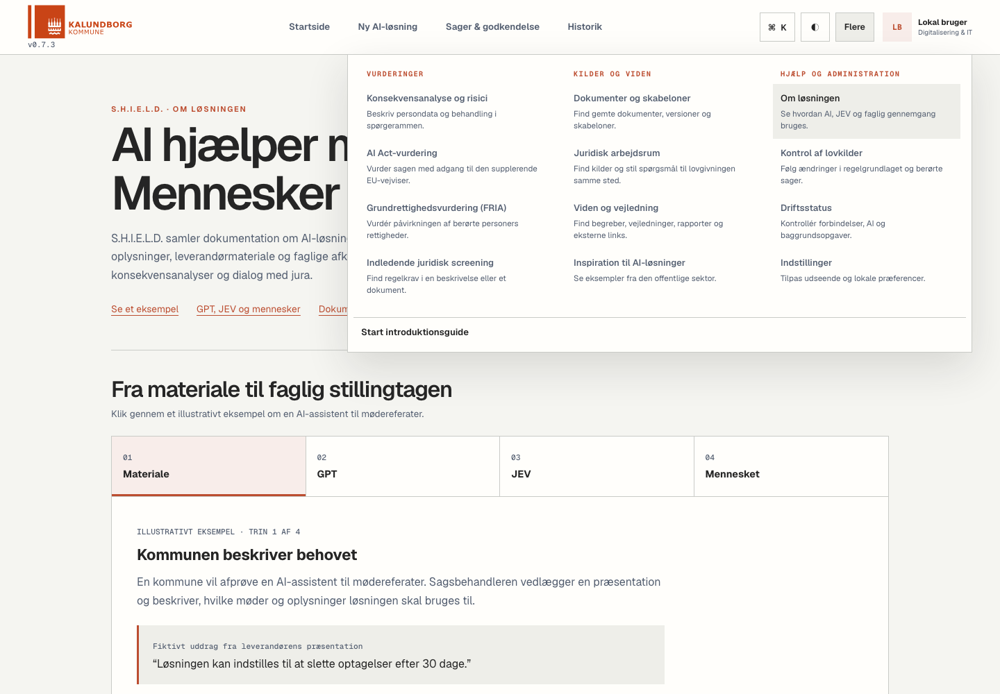

# Samlede værktøjer og funktionstest

Gennemført 21. september 2026 på den lokale løsning. Formålet var at fjerne overlap, gøre funktionerne forståelige og kontrollere dem med både browser, automatiske tests og rigtige modelkald.

## Færre indgange, sammenhængende arbejdsområder

Menuen **Flere** har nu 12 indgange mod tidligere 15, fordelt på Vurderinger, Kilder og viden samt Hjælp og administration.

| Arbejdsområde | Sammenlagte funktioner | Hvad bliver bevaret? |
| --- | --- | --- |
| Juridisk arbejdsrum | Kildesøgning og lovassistent | To faner: Find kilder og Spørg til lovgivning. Spørgsmål og resultater bevares ved faneskift. |
| Viden og vejledning | Opslagsværk, rapporter og vejledninger | Begreber i én fane og ét samlet katalog med 90 unikke links i den anden. De 41 rapporter vises kun i det fælles katalog. |
| AI Act-vurdering | Vurdering på en sag og EU-vejviseren | EU-vejviseren er et supplement i samme arbejdsområde. Den gemmer ikke en vurdering på sagen. Indtastninger bevares mellem de to faner. |

De gamle direkte links virker fortsat og åbner den tilsvarende fane. Fanernes indhold bevares under navigation i arbejdsområdet; dette er ikke en automatisk permanent lagring af alle kladder. Den eksisterende sagsbaserede gemmefunktion bruges fortsat.

Konsekvensanalyse, AI Act-vurdering og grundrettighedsvurdering er fortsat særskilte vurderingsspor. De dokumenterer forskellige forhold. Indledende juridisk screening er tydeligt mærket som en første screening og kan ikke alene godkende en løsning.

Menuen forklarer kort hver funktion og erstatter den tidligere lange, lodrette liste. Den kan lukkes med Escape, klik udenfor eller valg af en side. Mobilmenuen bruger de samme grupper.

## Rettelser fundet ved gennemgangen

- Ratebegrænsede endpoints kunne give HTTP 500, selv når selve kaldet lykkedes. Responsen håndteres nu korrekt.
- En forbindelsestest kunne melde succes uden et brugbart modelsvar. Kun faktisk, ikke-tom tekst tæller som succes.
- Research brugte ikke altid de valgte fokusområder og kunne indsætte faste resuméer eller erstatningskilder. Nu bruges hentet indhold; manglende kilder og modelsvigt markeres.
- Officielle PDF-kilder blev forsøgt læst som HTML. PDF og HTML udtrækkes nu særskilt med en størrelsesgrænse. Navigation og sidefod fjernes fra HTML-grundlaget.
- Samme kilde med forskellige sporingsparametre blev talt flere gange. Dubletter samles uden at sammenblande forskellige lov-ID'er.
- Et spørgsmål med et konkret lovnavn kunne hente uvedkommende love. Keyword-søgning afgrænser nu til det nævnte lovnavn.
- Umålte sikkerhedsprocenter er fjernet fra lovsvar og research. Modelnavn og kildeforbehold vises i stedet.
- Fejl eller afbrudte streams må ikke vises som færdige AI-svar. Modeltekst indsættes ikke som rå HTML.
- Dokumentupload til screening mistede formularmetadata og sagstilknytning. Originalfil, audit, sagsreference og lovkildelinks gemmes nu i samme transaktion.
- AI Act og FRIA har sagsvælger og fri navigation mellem formulartrin. Krav til indsendelse kontrolleres fortsat ved afslutningen.
- Uvirksomme indstillingsfaner og en gemmeknap uden funktion er fjernet. Faktiske browserindstillinger gemmes automatisk; notifikationsønsker beskrives ikke som aktiv levering.
- Egne opslagsnoter kan gemmes og slettes lokalt. Lagringsfejl vises, og noterne fremstilles ikke som fælles sagsdokumentation.
- Mørkt temas kontrast og mobilombrydning i dokumentbank og opslagsværk er rettet.

## Verificeret

**Automatiske tests:** 317 frontendtests i 32 suites og 725 backendtests i den samlede kørsel bestod. To eksisterende asynkrone demonstrationsscripts blev sprunget over af pytest. Den efterfølgende afgrænsede backendkørsel med URL-dedup bestod alle 57 tests. Produktionsbuild er gennemført.

**Browser:** Alle 15 oprindelige værktøjsruter er åbnet på desktop og mobil. De tre sammenlægninger er afprøvet med faneskift og bevarede indtastninger. Desuden er formularnavigation, validering, sagsvælger, tema efter genindlæsning, lokale noter, rapportfiltre, EU-vejviserens frem/tilbage og menuens tastaturbetjening kontrolleret. Eksisterende sager er ikke ændret af browserkontrollen.

**Rigtige modelkald:** GPT-5.6 Sol returnerede tekst gennem forbindelsestesten, lovassistenten og juridisk research. Den korrigerede lovsøgning returnerede kun Ferieloven til spørgsmålet om Ferielovens anvendelsesområde. Research leverede et svar med kildehenvisninger, og Datatilsynets PDF blev faktisk hentet og læst.

**Dokument til gemt resultat:** En syntetisk DOCX blev uploadet gennem det faktiske API med præcis én GPT-5.6 Sol-kørsel. I en separat database blev originalfil, audit, sagsreference og 13 lovkildelinks gemt. Den downloadede fil var byte-identisk med originalen. Resultatet blev BETINGET-GO med `assessment_complete=false` og 47 åbne afklaringer; manglende dokumentation blev ikke til automatisk godkendelse. Lovkilderegistret i denne prøve var syntetisk og dokumenterer alene integrationens funktion.

## Afgrænsning

Den lokale modeladapter er en midlertidig forbindelse til GPT-5.6 Sol. Den erstatter ikke en hosted SaaS-integration eller JEV. JEV og en ny fuld konsekvensanalyse af Gentofte-materialet er ikke kørt som del af denne kontrol. Lovassistentens lokale katalog er ikke aktualitetskontrolleret ved hvert spørgsmål; det fremgår ved svaret. Browserkontrollen blev udført med lokal udviklingsidentitet, ikke et nyt Microsoft Entra-login.

Repositoryets generelle typekontrol er fortsat ikke ren: `mypy src` rapporterede 361 fejl i 60 filer. Build har eksisterende lint-advarsler. Disse tværgående forhold er ikke gjort til en påstand om en produktionsklar SaaS-release.

Detaljerede lokale kvitteringer og isolerede testdata ligger i den Git-ignorerede mappe `.cache/more-menu-qa/`. Brugerens uploadede dokumenter, database, nøgler og rå testlogs indgår ikke i repositoryets ændringer.
